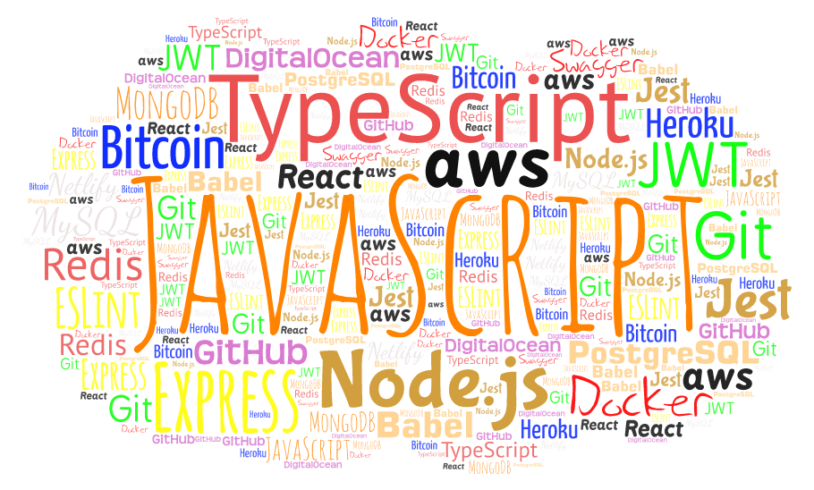

<h3 align="center">
  <samp>&gt; Hi I'm
    <b><a target="_blank" href="#">Wladimir</a></b>
  </samp>
</h3>

  <samp>
    「 A JavaScript developer 」
     
    「 Passionate for building applications & discussing new product ideas. 
  Reach out to me if you'd like to talk :v: 」
     
     
  </samp>

  

  
<samp>&#9776; A little more about me...</samp>

  

     
    
     

    
💻 Stack:

    

    
📫 How to reach me:

    
    
  

 

<samp>
  

    ════ ⋆★⋆ ════
     
    <i>"When will I know I'm ready?</i>  
    <i>You won't. It's a leap of faith."</i>
  

</samp>