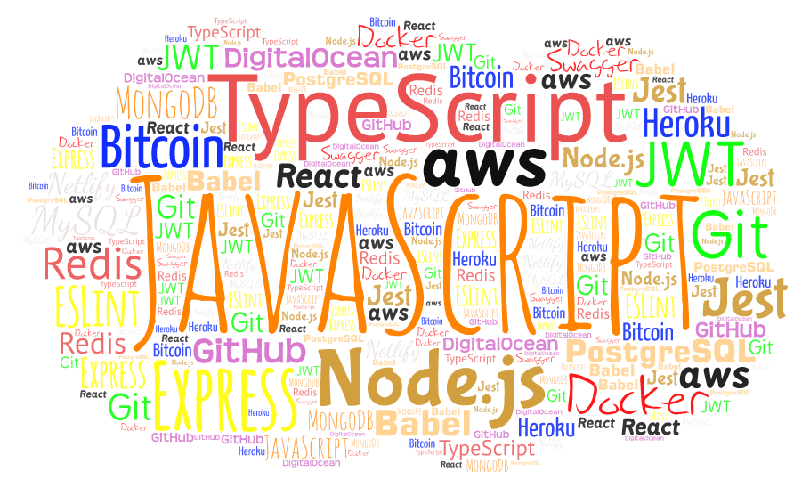

<h3 align="center">
  <samp>&gt; Hi, I'm
    <b><a target="_blank" href="#">Wladimir</a></b>
  </samp>
</h3>

  <samp>
    「 A JavaScript developer 」
     
    「 Passionate for building applications & discussing new product ideas. 
  Reach me out if you'd like to talk :v: 」
     
     
  </samp>

  

  
<samp>&#9776; A little more about me...</samp>

   

  
  
  

  <h3>📫 How to reach me:</h3>
  
  

 

  ════ ⋆★⋆ ════
   
  <i>"When will I know I'm ready?</i>  
  <i>You won't. It's a leap of faith."</i>

